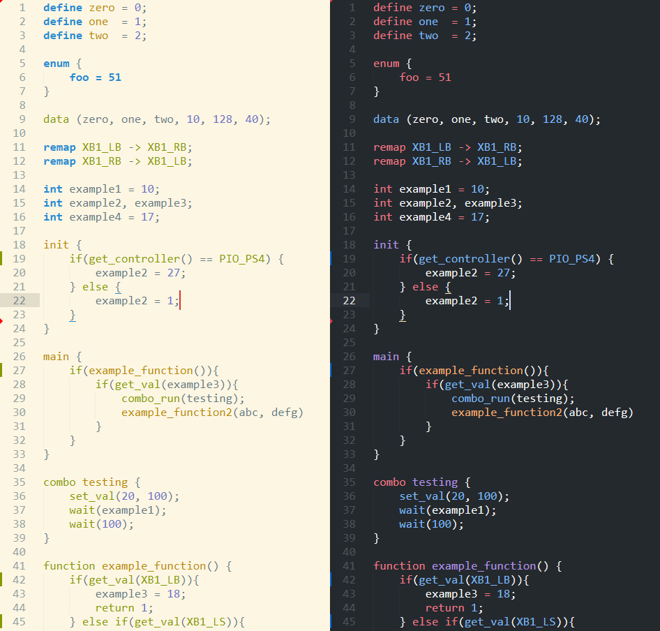

# gpc-st4
Syntax Highlighting &amp; Snippets for GPC Scripting language (https://beta.cronusmax.com/gpc-scripting)

## Installation
clone the repository (``git clone https://github.com/SVD00/gpc-st4``) into your packages directory  
Windows: ``%AppData%\Sublime Text\Packages\``  
Linux: ``~/.config/sublime-text``  
OSX: ``~/Library/Application Support/Sublime Text``  

## Example

